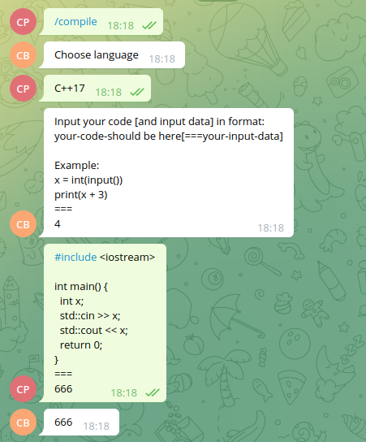
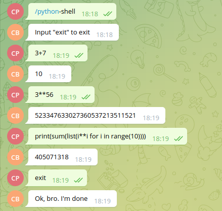
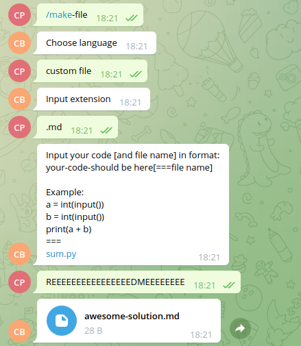

+++++++++++++++++++++Compiler Bot++++++++++++++++++++++

Supported commands:
1. /compile or /interpret (C++17 or Python3 code allowed). Will compile your code and return program output. 
    You can add input data in your message if you need.

2. /python-shell (something similar to the classic python-shell)

3. /make-file Will make and return file with necessary extension

The response to an unknown command is /makefile (txt)

===============Examples==============
1. 
2. 
3. 
